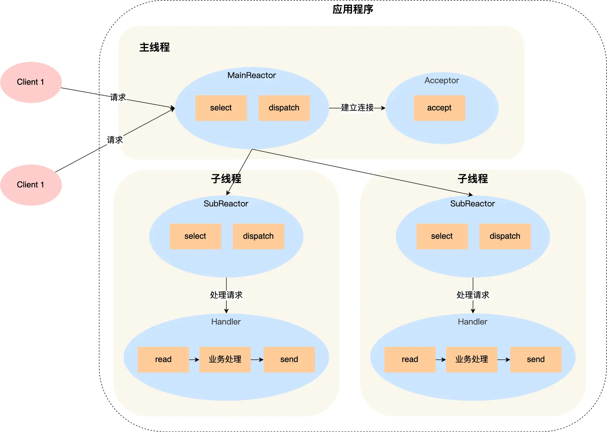

# Socket 网络编程实验技术方案

## Get Start

``` bash
pip install -r requirements.txt
```

## 整体设计

- 采用 `logging` 模块来提高服务器的可观测性
- 采用配置文件便于测试与修改，并维护服务器与客户端的统一性
- 通过完善的异常处理提高了服务的健壮性

## TCP 技术方案：多 Reactor 多线程模型

### 概述

采用了多 Reactor 多线程模型的技术方案，用于提升服务器的并发处理能力。本方案通过主线程（MainReactor）负责监听和分配连接请求，并将其分配给多个子线程（SubReactor）进行具体的业务处理。每个子线程拥有独立的事件循环和选择器（selector），实现对各自连接的异步非阻塞处理。

### 设计架构

1. **MainReactor（主线程）**
    - **功能**：监听新的连接请求，并将新连接分配给子线程。
    - **组件**：
      - `selectors.DefaultSelector`：选择器，用于监控连接建立事件。
      - `socket`：套接字，用于监听端口。
      - `accept` 方法：接受新连接并分配给子线程。

2. **SubReactor（子线程）**
    - **功能**：处理分配给它们的连接，通过 `select` 监听和处理事件。
    - **组件**：
      - `selectors.DefaultSelector`：选择器，用于监控子线程的连接事件。
      - `register` 方法：将新的连接注册到选择器。
      - `read` 方法：读取连接数据并进行业务处理。
      - `threading.Thread`：多线程模块，用于启动子线程。

### 关键流程

1. **主线程启动**
    - 主线程创建并启动 `MainReactor`，开始监听配置文件中指定的端口。
    - 创建多个 `SubReactor` 子线程，并启动它们。

2. **连接接受和分配**
    - `MainReactor` 通过 `select` 监控新的连接请求。
    - 当有新的连接请求时，调用 `accept` 方法接受连接。
    - 将新的连接按轮询方式分配给 `SubReactor` 子线程。

3. **子线程处理**
    - 子线程的 `SubReactor` 对象通过 `select` 监控分配到的连接。
    - 当连接有新的事件（如可读事件）时，调用 `read` 方法进行处理。
    - 在 `read` 方法中，处理连接的读写操作，完成具体的业务逻辑。

### 优点

1. **高并发处理能力**：通过多线程处理提高了服务器的并发处理能力。
2. **代码清晰**：主线程和子线程职责分明，代码逻辑清晰。
3. **扩展性强**：可以轻松增加或减少子线程数量，以适应不同的负载需求。



## 技术方案：多线程 UDP 服务器

### 概述

UDP 服务器采用了基于 `ThreadPoolExecutor` 的多线程 UDP 服务器技术方案。本方案通过主线程监听 UDP 请求，并使用线程池将请求分发给多个工作线程进行处理。该方法能够高效地处理并发请求，提高服务器的响应能力。

### 设计架构

1. **主线程**
    - **功能**：监听 UDP 请求，并将请求数据提交到线程池中进行处理。
    - **组件**：
        - `socket`：创建 UDP 套接字，绑定到指定的主机和端口。
        - `recvfrom` 方法：接收来自客户端的数据包。
        - `ThreadPoolExecutor`：线程池，用于并发处理请求。

2. **工作线程**
    - **功能**：处理接收到的请求，解析数据并生成响应。
    - **组件**：
        - `handle_request` 方法：解析请求数据并生成响应。

### 关键流程

2. **主线程启动**
    - 主线程创建并绑定 UDP 套接字，开始监听指定的端口。
    - 创建 `ThreadPoolExecutor` 对象，设定最大工作线程数为 10。

3. **接收和分发请求**
    - 主线程通过 `recvfrom` 方法接收客户端发送的数据包。
    - 将接收到的数据包提交到线程池中，由工作线程处理。

4. **请求处理**
    - 工作线程调用 `handle_request` 方法，解析请求数据，生成并发送响应。
    - 根据请求内容（如用户名和密码）生成响应消息并发送回客户端。

### 优点

1. **高并发处理能力**：通过线程池并发处理请求，提高了服务器的吞吐量。
2. **代码简洁清晰**：主线程和工作线程职责分明，代码结构清晰。

### 架构图


